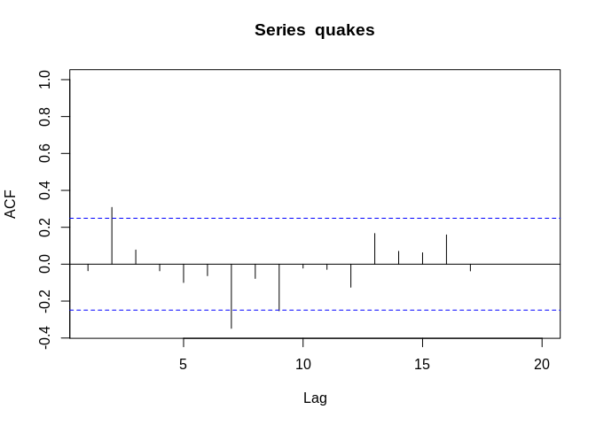

stat510\_1
================
Christoper Chan
December 1, 2018

1.1 Overview
------------

-   AR(1) model: *x*<sub>*t*</sub> = *δ* + *ϕ*<sub>1</sub>*x*<sub>*t* − 1</sub> + *w*<sub>*t*</sub>
    -   Same properties of linear regression

1.2 Sample ACF and Properities of AR(1) Model
---------------------------------------------

-   Weakly stationary series requirements:
    1.  Mean *E*(*x*<sub>*t*</sub>) is same for all *t*
    2.  Variance of *x*<sub>*t*</sub> is same for all *t*
    3.  Corvariance and correlation between *x*<sub>*t*</sub> and *x*<sub>*t* − *h*</sub> is same for all *t*
-   Autocorrelation function (ACF) = gives correlation between *x*<sub>*t*</sub> and *x*<sub>*t* − *h*</sub> for *h* = 1, 2...*n*
    -   ACF =
        $$\\frac{Cov(x\_t, x\_{t-h})}{s(x\_t)s(x\_t)} = \\frac{Cov(x\_t, x\_{t-h})}{Var(x\_t)}$$
-   Properties of AR(1) model:
    -   Mean(*μ*) = $\\frac{\\delta}{1-\\phi\_1}$
    -   Var(*x*<sub>*t*</sub>) = $\\frac{\\sigma^2\_w}{1-\\phi^2\_1}$
    -   Cor(*ρ*<sub>*h*</sub>) = *ϕ*<sub>1</sub><sup>2</sup>
-   Create stationary series by first differences (*y*<sub>*t*</sub> = *x*<sub>*t*</sub> − *x*<sub>*t* − 1</sub>)

1.3 Coded Examples
------------------

``` r
library(tidyverse)
```

    ## Warning: package 'tidyverse' was built under R version 3.4.4

    ## Warning: package 'ggplot2' was built under R version 3.4.4

    ## Warning: package 'tibble' was built under R version 3.4.4

    ## Warning: package 'tidyr' was built under R version 3.4.4

    ## Warning: package 'readr' was built under R version 3.4.4

    ## Warning: package 'purrr' was built under R version 3.4.4

    ## Warning: package 'dplyr' was built under R version 3.4.3

    ## Warning: package 'stringr' was built under R version 3.4.3

    ## Warning: package 'forcats' was built under R version 3.4.4

``` r
library(forecast)
```

    ## Warning: package 'forecast' was built under R version 3.4.4

``` r
my_quakes <- scan('data/quakes.txt')
head(my_quakes)
```

    ## [1] 840 157 145  44  33 121

``` r
quakes = ts(my_quakes)
```

Honestly, I've looked around for ways to plot this in ggplot2 and I'm just not sure. Because there is no X component of dataset quakes, I'm not sure how

``` r
plot(quakes, type='b')
```


``` r
lag.plot(quakes, lags=1, do.lines=F)
```


``` r
acf(quakes, xlim=c(1,20))
```



Regression of quakes$x and created variable of lag\_1

``` r
quakes_lag1 <- lag(my_quakes, 1)

y = cbind(my_quakes, quakes_lag1)
ar1_lr <- lm(y[,1]~y[,2])
summary(ar1_lr)
```

    ## 
    ## Call:
    ## lm(formula = y[, 1] ~ y[, 2])
    ## 
    ## Residuals:
    ##     Min      1Q  Median      3Q     Max 
    ## -432.68 -303.62  -88.72  222.02 1464.08 
    ## 
    ## Coefficients:
    ##             Estimate Std. Error t value Pr(>|t|)    
    ## (Intercept) 446.2549    76.8811   5.804 2.72e-07 ***
    ## y[, 2]       -0.0355     0.1293  -0.275    0.785    
    ## ---
    ## Signif. codes:  0 '***' 0.001 '**' 0.01 '*' 0.05 '.' 0.1 ' ' 1
    ## 
    ## Residual standard error: 402.9 on 59 degrees of freedom
    ##   (1 observation deleted due to missingness)
    ## Multiple R-squared:  0.001276,   Adjusted R-squared:  -0.01565 
    ## F-statistic: 0.07537 on 1 and 59 DF,  p-value: 0.7846

``` r
print(y[,2])
```

    ##  [1]   NA  840  157  145   44   33  121  150  280  434  736  584  887  263
    ## [15] 1901  695  294  562  721   76  710   46  402  194  759  319  460   40
    ## [29] 1336  335 1354  454   36  667   40  556   99  304  375  567  139  780
    ## [43]  203  436   30  384  129    9  209  599   83  832  328  246 1617  638
    ## [57]  937  735   38  365   92   82
