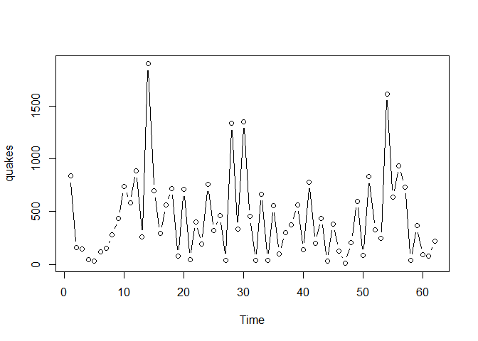
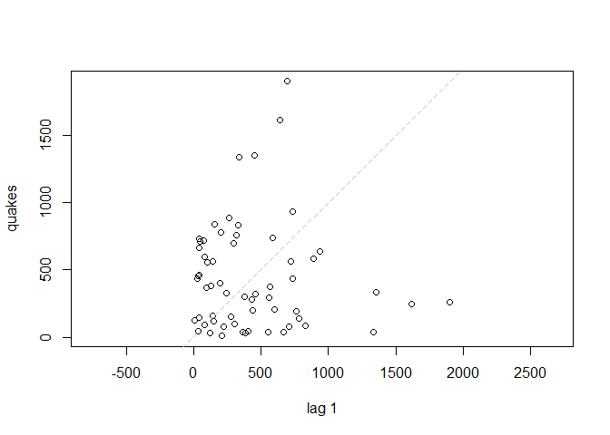
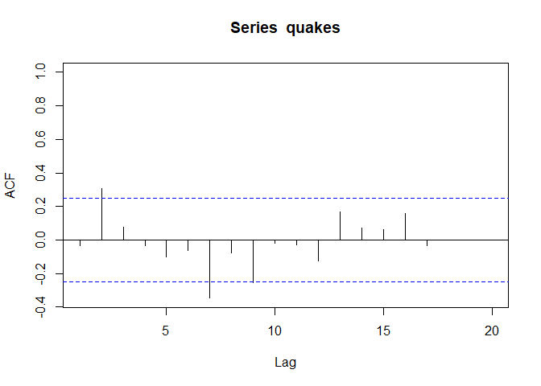

stats510\_1
================
Christoper Chan
December 1, 2018

1.1 Overview
------------

-   AR(1) model: 
    -   Same properties of linear regression

1.2 Sample ACF and Properities of AR(1) Model
---------------------------------------------

-   Weakly stationary series requirements:
    1.  Mean ") is same for all *t*
    2.  Variance of  is same for all *t*
    3.  Corvariance and correlation between  and  is same for all *t*
-   Autocorrelation function (ACF) = gives correlation between  and  for 
    -   ACF = }{s(x_t)s(x_t)} = \frac{Cov(x_t, x_{t-h})}{Var(x_t)}")
-   Properties of AR(1) model:
    -   Mean() = 
    -   Var() = 
    -   Cor() = 
-   Create stationary series by first differences ()

1.3 Coded Examples
------------------

``` r
library(tidyverse)
library(forecast)
```

``` r
my_quakes <- scan('data/quakes.txt')
head(my_quakes)
```

    ## [1] 840 157 145  44  33 121

``` r
quakes = ts(my_quakes)
```

Honestly, I've looked around for ways to plot this in ggplot2 and I'm just not sure. Because there is no X component of dataset quakes, I'm not sure how

``` r
plot(quakes, type='b')
```



``` r
lag.plot(quakes, lags=1, do.lines=F)
```



``` r
acf(quakes, xlim=c(1,20))
```



Regression of quakes$x and created variable of lag\_1

``` r
quakes_lag1 <- lag(my_quakes, 1)

y = cbind(my_quakes, quakes_lag1)
ar1_lr <- lm(y[,1]~y[,2])
summary(ar1_lr)
```

    ## 
    ## Call:
    ## lm(formula = y[, 1] ~ y[, 2])
    ## 
    ## Residuals:
    ##     Min      1Q  Median      3Q     Max 
    ## -432.68 -303.62  -88.72  222.02 1464.08 
    ## 
    ## Coefficients:
    ##             Estimate Std. Error t value Pr(>|t|)    
    ## (Intercept) 446.2549    76.8811   5.804 2.72e-07 ***
    ## y[, 2]       -0.0355     0.1293  -0.275    0.785    
    ## ---
    ## Signif. codes:  0 '***' 0.001 '**' 0.01 '*' 0.05 '.' 0.1 ' ' 1
    ## 
    ## Residual standard error: 402.9 on 59 degrees of freedom
    ##   (1 observation deleted due to missingness)
    ## Multiple R-squared:  0.001276,   Adjusted R-squared:  -0.01565 
    ## F-statistic: 0.07537 on 1 and 59 DF,  p-value: 0.7846
