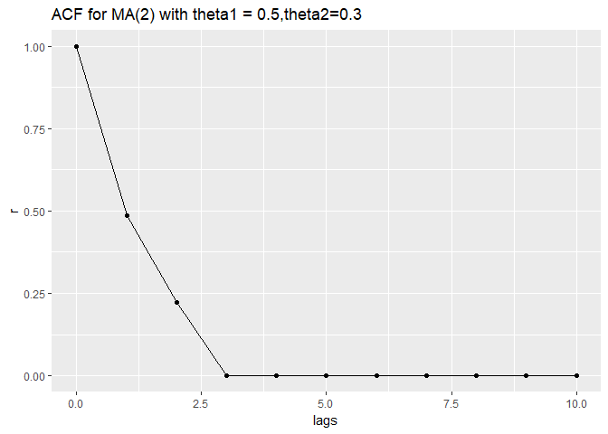
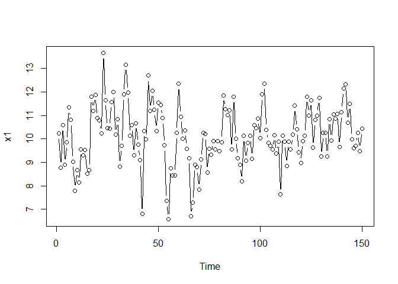
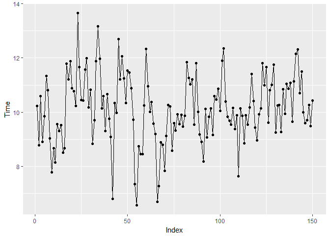

stats510\_2
================
Christoper Chan
December 4, 2018

2.1 Moving Average Models
-------------------------

-   1st order MA(1) = *x*<sub>*t*</sub> = *μ* + *w*<sub>*t*</sub> + *θ*<sub>1</sub>*w*<sub>*t* − 1</sub>
    -   qth order MA(*q*) = *x*<sub>*t*</sub> = *μ* + *w*<sub>*t*</sub> + *θ*<sub>1</sub>*w*<sub>*t* − 1</sub> + *θ*<sub>2</sub>*w*<sub>*t* − 2</sub> + ... + *θ*<sub>*q*</sub>*w*<sub>*t* − *q*</sub>
    -   Properties:
        -   Mean *E*(*x*<sub>*t*</sub>)=*μ*
        -   *V**a**r*(*x*<sub>*t*</sub>)=*σ*<sub>*w*</sub><sup>2</sup>(1 + *θ*<sub>1</sub><sup>2</sup>)
        -   ACF =
            $$rho\_1 = \\frac{\\theta\_1}{1 + \\theta^2\_1}$$
             and *ρ*<sub>*h*</sub> = 0 for *h* ≥ 2
            -   For MA(q): nonzero AC for first q lags and *A**C* = 0 for $lags\\legq$

``` r
library(tidyverse)
library(zoo)
```

``` r
ma2 <- ARMAacf(ma=c(0.5, 0.3), lag.max=10)
ma2
```

    ##         0         1         2         3         4         5         6 
    ## 1.0000000 0.4850746 0.2238806 0.0000000 0.0000000 0.0000000 0.0000000 
    ##         7         8         9        10 
    ## 0.0000000 0.0000000 0.0000000 0.0000000

``` r
lags <- data.frame(0:10)
s <- cbind(ma2, lags, make.row.names = T)
print(s)
```

    ##          ma2 X0.10 make.row.names
    ## 0  1.0000000     0           TRUE
    ## 1  0.4850746     1           TRUE
    ## 2  0.2238806     2           TRUE
    ## 3  0.0000000     3           TRUE
    ## 4  0.0000000     4           TRUE
    ## 5  0.0000000     5           TRUE
    ## 6  0.0000000     6           TRUE
    ## 7  0.0000000     7           TRUE
    ## 8  0.0000000     8           TRUE
    ## 9  0.0000000     9           TRUE
    ## 10 0.0000000    10           TRUE

``` r
ggplot(s, aes(lags, ma2)) +
  geom_point() +
  geom_line() +
  ylab('r') +
  ggtitle('ACF for MA(2) with theta1 = 0.5,theta2=0.3')
```

    ## Don't know how to automatically pick scale for object of type data.frame. Defaulting to continuous.



``` r
xc <- arima.sim(n=150, list(ma=c(0.5, 0.3)))
x <- as_tibble(xc + 10)

plot(x, type='b')
```



``` r
autoplot.zoo(x, geom = 'point') + geom_line()
```

    ## Don't know how to automatically pick scale for object of type ts. Defaulting to continuous.


