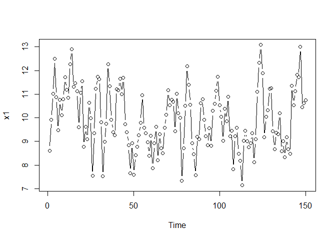
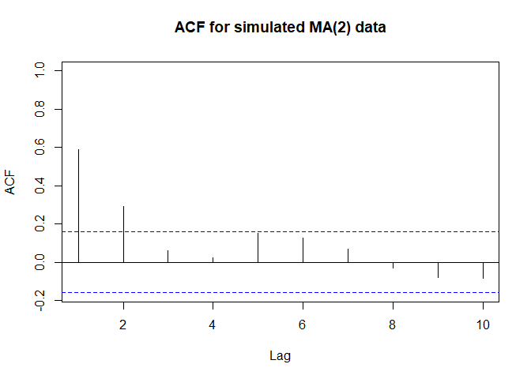

stats510\_2
================
Christoper Chan
December 4, 2018

2.1 Moving Average Models
-------------------------

-   1st order MA(1) = 
    -   qth order MA() = 
    -   Properties:
        -   Mean  = \mu")
        -    = \sigma^2_w(1 + \theta^2_1)")
        -   ACF =

            

             and  for 
            -   For MA(q): nonzero AC for first q lags and  for 

``` r
library(tidyverse)
library(zoo)
```

``` r
ma2 <- ARMAacf(ma=c(0.5, 0.3), lag.max=10)
ma2
```

    ##         0         1         2         3         4         5         6 
    ## 1.0000000 0.4850746 0.2238806 0.0000000 0.0000000 0.0000000 0.0000000 
    ##         7         8         9        10 
    ## 0.0000000 0.0000000 0.0000000 0.0000000

``` r
lags <- data.frame(0:10)
s <- cbind(ma2, lags, make.row.names = T)
print(s)
```

    ##          ma2 X0.10 make.row.names
    ## 0  1.0000000     0           TRUE
    ## 1  0.4850746     1           TRUE
    ## 2  0.2238806     2           TRUE
    ## 3  0.0000000     3           TRUE
    ## 4  0.0000000     4           TRUE
    ## 5  0.0000000     5           TRUE
    ## 6  0.0000000     6           TRUE
    ## 7  0.0000000     7           TRUE
    ## 8  0.0000000     8           TRUE
    ## 9  0.0000000     9           TRUE
    ## 10 0.0000000    10           TRUE

``` r
ggplot(s, aes(lags, ma2)) +
  geom_point() +
  geom_line() +
  ylab('r') +
  ggtitle('ACF for MA(2) with theta1 = 0.5,theta2=0.3')
```

    ## Don't know how to automatically pick scale for object of type data.frame. Defaulting to continuous.


``` r
xc <- arima.sim(n=150, list(ma=c(0.5, 0.3)))
x <- as_tibble(xc + 10)

plot(x, type='b')
```



``` r
autoplot.zoo(x, geom = 'point') + 
  geom_line() +
  ylab('Time')
```

    ## Don't know how to automatically pick scale for object of type ts. Defaulting to continuous.


``` r
  ggtitle('Simulated MA(2) Series')
```

    ## $title
    ## [1] "Simulated MA(2) Series"
    ## 
    ## $subtitle
    ## NULL
    ## 
    ## attr(,"class")
    ## [1] "labels"

``` r
acf(x, xlim = c(1,10), main = 'ACF for simulated MA(2) data')
```



2.2 Partial Autocorrelation Function (PACF)
-------------------------------------------

-   qth order PACF =

    }{\sqrt{Var(x_t|x_{t-1},... x_{t-q-1})Var(x_{t-q}|x_{t-1},... x_{t-q-1})}}")

    -   For AR model PACF is order of the model

2.3 Notational conventions
--------------------------
